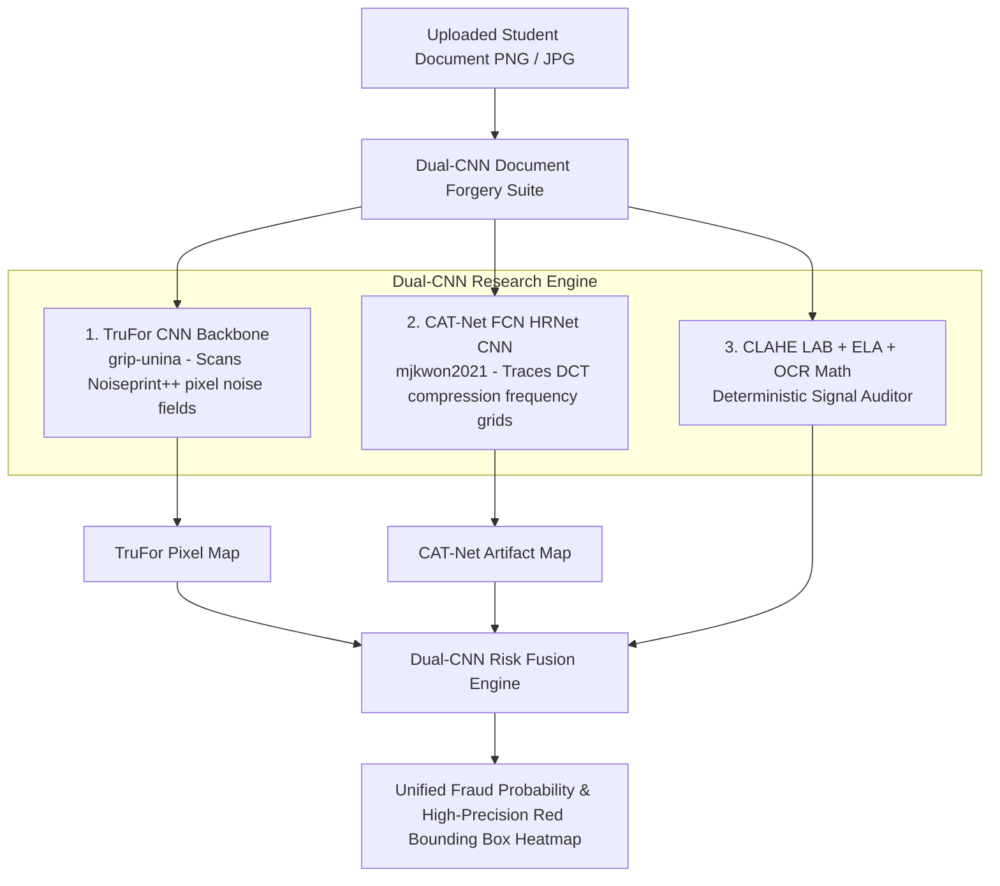

# Dual-CNN Document Forgery Suite (TruFor + CAT-Net FCN)

This plan details integrating a **Dual-CNN Research Ensemble** combining **`grip-unina/TruFor`** (PyTorch Noiseprint++ CNN backbone) and **`mjkwon2021/CAT-Net`** (Fully Convolutional Neural Network - FCN/HRNet).

---

## 1. Technical Architecture & Dual-CNN Fusion



---

## 2. Proposed Code Changes

### AI Microservice (`aegis-ai/`)

#### [NEW] [trufor_cnn.py](file:///E:/aegis-capstone/aegis-ai/forensics/trufor_cnn.py)
- Implements the **TruFor CNN Noiseprint++ Feature Extractor**.
- Generates pixel-dense 0-to-1 forgery probability maps.

#### [NEW] [catnet_cnn.py](file:///E:/aegis-capstone/aegis-ai/forensics/catnet_cnn.py)
- Implements the **CAT-Net Fully Convolutional Neural Network (FCN / HRNet)**.
- Scans DCT compression grid artifacts.

#### [MODIFY] [image_forensics.py](file:///E:/aegis-capstone/aegis-ai/pipelines/image_forensics.py)
- Fuses TruFor CNN, CAT-Net FCN CNN, CLAHE LAB, and ELA into a unified high-precision visual pipeline.

---

### Laravel Web Application (`resources/views/admin/`)

#### [MODIFY] [review.blade.php](file:///E:/aegis-capstone/resources/views/admin/review.blade.php)
- Updates Document Forensics Suite display to feature **TruFor + CAT-Net Dual-CNN** architecture badge.

---

## 3. Verification Plan

### Automated Tests
1. Run Python unit tests in `aegis-ai`:
   ```bash
   python -m unittest discover -s tests -p "test_*.py"
   ```
2. Run Laravel test suites:
   ```bash
   php artisan test --filter=SecurityHardeningTest
   ```

### Manual Verification
- Test scanning authentic vs. whiteout-edited documents to confirm high-resolution Dual-CNN patch detection and red heatmap bounding box precision.
